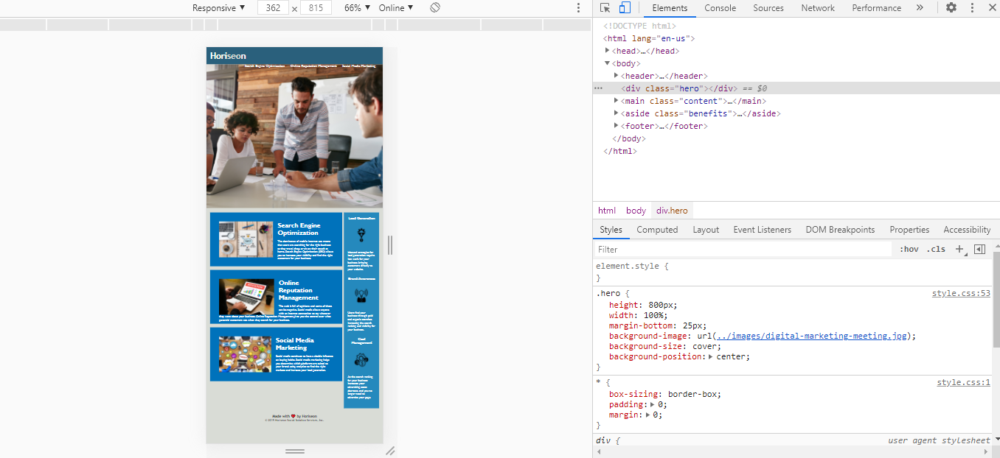

# Code-Refactor

## Task

- To refactor the Horiseon website's codebase to follow accessibility standards so the site is optimized for search engines.
- Make the CSS more efficient through consolidation.
- Follow the semantic structure of the HTML elements.

A code refactor allows the webpage to look and function effectivel on different size media ex: desktop computer, tablet or cellphone

## Functionality

Responsive website

## Technologies & Skills Used

Inspect tool on webpage- the toolbar allows the developer to adjust the media size for the refactor

## Deployment
---
The URL of the [deployed](https://tweeks07.github.io/Code-Refactor/) application

The URL of the GitHub [repository](https://git@github.com/tweeks07/Code-Refactor)

## Contact Info
---
Taylor Weeks

Email:  taylorlweeks707@gmail.com

[Github](https://github.com/tweeks07)

---
© 2021 Trilogy Education Services, LLC, a 2U, Inc. brand. Confidential and Proprietary. All Rights Reserved.
